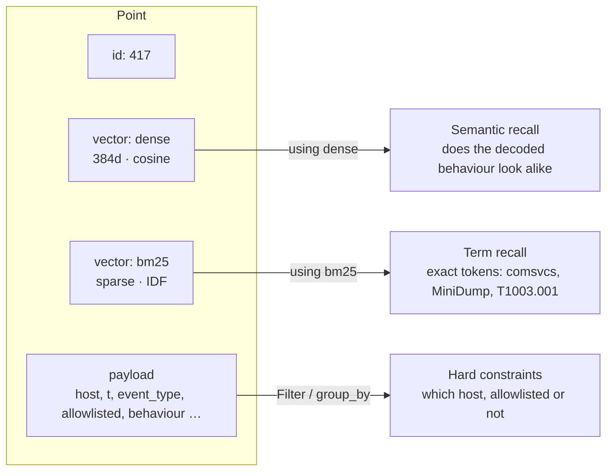
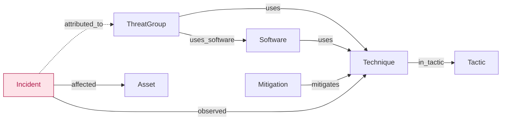
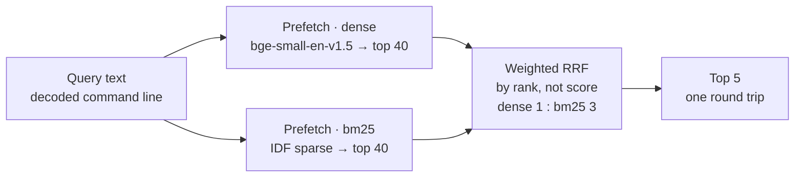
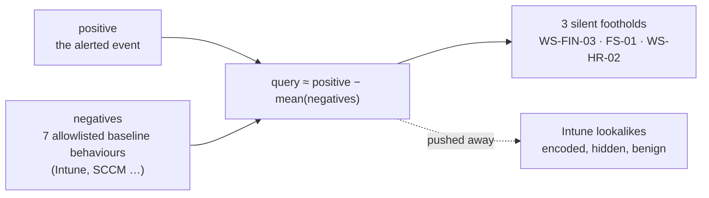

# SENTINEL: SOC Copilot on Qdrant × Cognee

Demo for Qdrant & Cognee *Bring Your Own Demo Night* (Berlin). 5 minutes, fully local, no API keys.

## Launch

```bash
./run.sh            # starts Qdrant + ingests on first run + serves http://localhost:8916
./run.sh --build    # force re-ingest
```

Presenting: open http://localhost:8916 in the browser, press `F` for fullscreen, press `SPACE` to advance each step.

| Key | Action |
|---|---|
| `SPACE` / `→` | Next step |
| `B` | Back to the network topology (keeps compromised state and attack paths) |
| `G` | Switch to the Cognee knowledge graph |
| `ESC` | Close the report |
| `R` | Reset |

## Architecture

```
MITRE ATT&CK STIX ──┬─> Qdrant  threat_kb      (697 techniques + 2,410 Windows Sigma rules, dense bge-small + sparse BM25)
SigmaHQ rules ──────┘
Synthetic telemetry ──> Qdrant  endpoint_logs  (~1.3k process events, 27 hosts, 1 hidden intrusion)
ATT&CK relationships ─> Cognee graph (Ladybug) + vector index (Qdrant, community adapter)
                        ThreatGroup ─uses→ Technique ─in_tactic→ Tactic; Mitigation ─mitigates→ Technique ...
```

| Step | What happens | Technique |
|---|---|---|
| ① Decode | base64 / UTF-16LE decoding, IOC extraction | local |
| ② Map to ATT&CK | Dense vs BM25 vs hybrid, shown side by side | Qdrant `query_points` + `prefetch` + weighted RRF (dense 1 : BM25 3) |
| ③ Hunt | Find hosts that "behave the same" but raised no alert | Qdrant `query_points_groups(group_by=host)` → Recommend API (allowlisted negatives) |
| ④ Graph reasoning | Attribute the likely APT group, predict the next steps, recommend mitigations, write the incident to memory | Cognee graph (built with `add_data_points`) traversal + incident written back as memory |
| ⑤ Report | Streamed incident report + generated Sigma rule | Grounded template (switches to a local LLM automatically if Ollama is running) |

Optional: install Ollama and run `ollama pull qwen2.5:7b`. The executive summary will then be written by the local model (`LOCAL_LLM_MODEL` sets the model).

## How the data is modelled in Qdrant

Qdrant's data model is only three layers: **Collection → Point → (id, vectors, payload)**. The part that is easy to miss is that `vectors` is plural: one point can carry several **named vectors**, each with its own size and distance. Payload is arbitrary JSON, but a field needs a payload index before it can be filtered or grouped on efficiently.

So a point is not "data plus some attributes". It sits on three parallel retrieval channels at once:



`Prefetch` combines the first two into one ranking; `Filter` prunes any of them up front. Modelling came down to four decisions: how many vectors, what goes into the payload, which fields get indexed, and what counts as one point. The collections below are three different answers.

### `threat_kb` — 3,107 points · dense + BM25

697 MITRE ATT&CK techniques and 2,410 Windows Sigma rules ([`backend/build.py`](backend/build.py)).

```python
client.create_collection(
    name,
    vectors_config={"dense": models.VectorParams(size=384, distance=models.Distance.COSINE)},
    sparse_vectors_config={"bm25": models.SparseVectorParams(modifier=models.Modifier.IDF)},
)
client.create_payload_index(KB_COLLECTION, "kind", PayloadSchemaType.KEYWORD)
client.create_payload_index(KB_COLLECTION, "attack_ids", PayloadSchemaType.KEYWORD)
```

`modifier=IDF` is the switch for native BM25: Qdrant keeps the term statistics server-side, and the client only sends `{indices, values}` from FastEmbed.

Two very different kinds of entity live in **one** collection, told apart by `kind`:

| payload field | `kind = technique` | `kind = sigma` |
|---|---|---|
| `title` | `T1055.011 Process Injection: EWM Injection` | Sigma rule title |
| `text` | the embedded text: ID + name + description (first 1,500 chars) | title + description + logsource + detection keywords + tags |
| `attack_ids` | `["T1055.011"]` | every ATT&CK tag on the rule |
| `tactics` / `url` | `["stealth", "privilege-escalation"]` · MITRE link | — |
| `level` / `path` / `rule_id` / `raw` | — | severity, repo path, rule UUID, **full YAML** |

> **Why not two collections?** A command line should compete against techniques and detection rules in the same ranking, and the score decides which it resembles more. When only Sigma rules are wanted (e.g. picking the rule for the report), a `kind` filter costs one index lookup.

### `endpoint_logs` — 1,282 points · 27 hosts · dense only

One synthetic day of endpoint telemetry with a full intrusion chain hidden inside ([`backend/scenario.py`](backend/scenario.py)). There is no sparse vector here: attackers change the base64 payload, so term matching is exactly the channel that breaks.

```json
{"id": 1, "t": 21618, "host": "DC-01", "user": "SYSTEM",
 "parent": "services.exe", "process": "lsass.exe",
 "cmdline": "C:\\Windows\\system32\\lsass.exe", "decoded": null,
 "event_type": "process_creation", "allowlisted": false,
 "alert": null, "severity": null, "truth": "benign",
 "behaviour": "services.exe spawned lsass.exe: C:\\Windows\\system32\\lsass.exe"}
```

> **The most valuable line in the demo:** what gets embedded is not `cmdline` but `behaviour`. The `-EncodedCommand` is decoded first, then normalised into "parent spawned child: what it does". A new base64 payload changes every byte, but this sentence barely moves. **Choosing what to embed matters more than choosing the embedding model.** The three silent lateral-movement hosts are found by similarity only because of this step. Host and user names are left out of the embedded text so the model can't "cheat" on them.

Exactly four payload indexes, one for each filter or grouping the queries use:

| field | type | used for |
|---|---|---|
| `host` | keyword | `group_by="host"`, and excluding the source host |
| `event_type` | keyword | restricting search to `process_creation` |
| `allowlisted` | bool | fetching IT baseline events as Recommend negatives — the only reason it exists |
| `t` | integer | timeline ordering and range queries (seconds since midnight) |

### Cognee collections — derived from `DataPoint` classes

These are not written by hand. Cognee reads the class definitions and creates one Qdrant collection per `{ClassName}_{index_field}`:

```
Technique_name   Technique_summary   ThreatGroup_name   Software_name   Mitigation_name
Tactic_name      Asset_hostname      EdgeType_relationship_name         Incident_summary (after the first incident)
```

```python
class Technique(DataPoint):
    attack_id: str
    name: str
    summary: str
    in_tactic: list[Tactic] = []                          # DataPoint-typed field → graph edge named after the field
    metadata = {"index_fields": ["name", "summary"]}      # each field → its own Qdrant collection
```

Scalar fields become node properties, `DataPoint`-typed fields become edges named after the field, and every `index_fields` entry is embedded into its own collection ([`backend/graph_models.py`](backend/graph_models.py)). The graph is built deterministically from MITRE's own relationships with `add_data_points` — no LLM extraction — so every edge traces back to source data.



The three `Incident` edges are written at runtime: when an analysis finishes, `add_data_points([Incident(...)])` stores the incident with its observed techniques, affected assets and suspected groups, so the next investigation starts from that memory.

## The four query patterns

Each modelling choice above exists for one of the queries in [`backend/copilot.py`](backend/copilot.py).

### 1. Side-by-side retrieval — `query_points` + `Prefetch` + weighted RRF

The same decoded command line goes down dense, BM25 and a fused path, shown next to each other.

```python
query_points(KB, query=dv, using="dense")   # semantic: does it look like an attack behaviour
query_points(KB, query=sv, using="bm25")    # term: does this exact token appear

query_points(KB,
    prefetch=[Prefetch(query=dv, using="dense", limit=40),
              Prefetch(query=sv, using="bm25",  limit=40)],
    query=RrfQuery(rrf=Rrf(weights=[1.0, 3.0])), limit=5)
```



RRF fuses by **rank**, not raw score, so cosine similarity and BM25 scores never need to be normalised against each other. Both recalls and the fusion run server-side in one request.

Why the weights: with equal-weight RRF, dense noise pushed real hits out of the top 5, and on the `comsvcs MiniDump` alert hybrid scored lower than BM25 alone. Security text is full of exact tokens (DLL names, cmdlets) that a small embedding model blurs, so BM25 counts 3×. Hits that carry the alert's dominant technique:

| alert | dense | BM25 | hybrid (1:3) |
|---|---|---|---|
| #624 `comsvcs.dll MiniDump` | **0 / 4** | 4 / 5 | **4 / 4** |
| #610 encoded PowerShell download | 4 / 4 | 3 / 4 | **4 / 4** |

(Sigma rules without an ATT&CK tag are not counted.)

### 2. A point ID as the query — `query=<point_id>`

`query_points(LOG, query=event_id, using="dense")` reuses the stored vector of an existing point, with no fetch-and-re-embed. "Find events that behave like this alert" is one line.

### 3. One result per host — `query_points_groups`

```python
query_points_groups(LOG, query=query, using="dense",
    group_by="host", limit=40, group_size=1,           # keep only the best match per host
    query_filter=Filter(
        must=[FieldCondition(key="event_type", match=MatchValue(value="process_creation"))],
        must_not=[FieldCondition(key="host", match=MatchValue(value=exclude_host))]))
```

Without grouping, a host that ran the same payload many times would fill the whole result list. `group_size=1` turns "similar events" into "similar **hosts**", which is what a hunt actually needs — and it relies on the keyword index on `host`.

### 4. Positive and negative examples — `RecommendQuery` · `AVERAGE_VECTOR`

```python
negs = [p.id for p in scroll(LOG, filter=allowlisted == True)]   # IT baseline: Intune / SCCM remote execution

RecommendQuery(recommend=RecommendInput(
    positive=[event_id], negative=negs,
    strategy=RecommendStrategy.AVERAGE_VECTOR))
```



Legitimate remote execution and an attacker's lateral movement are semantically very close. Plain similarity already ranks the three victims first, but Intune scripts sit right below with almost the same score. Subtracting the baseline tells Qdrant "like this attack, but not like IT ops", and the lookalikes drop out. That is the whole reason the `allowlisted` bool exists. The scores are then turned into z-scores: a host with z ≥ 1 that is not allowlisted is marked compromised.

## What each layer is responsible for

The first three layers combine inside a single `query_points` call; the fourth is a graph traversal.

| layer | answers | breaks down when |
|---|---|---|
| **dense** | does the behaviour look alike — fuzzy, robust to obfuscation | IDs differ only by digits, e.g. T1003.001 vs T1003.002 |
| **bm25** | does this exact term appear — technique IDs, tool names | the attacker re-encodes the base64 |
| **payload** | hard constraints — which host, which event type, allowlisted or not | it can only filter, not rank; without an index it falls back to a full scan |
| **graph** | what was *not* observed — who uses these techniques, what comes next, how to mitigate | the relationship data is incomplete; missing edges can't be inferred |

> **The point of the architecture:** vectors find what is similar; the graph infers what was not observed. The three silent hosts were found by vector search; the attacker's likely next steps and the mitigations to deploy came from the graph. Either half alone is not a complete investigation.

## Demo-day checklist
- [ ] Run `./run.sh` in advance and click through once so the models and caches are warm
- [ ] Connect the projector, set the browser zoom to 100%, press F for fullscreen
- [ ] Turn off Wi-Fi and rehearse once to confirm the demo works fully offline
